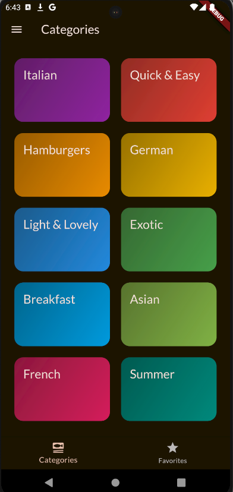
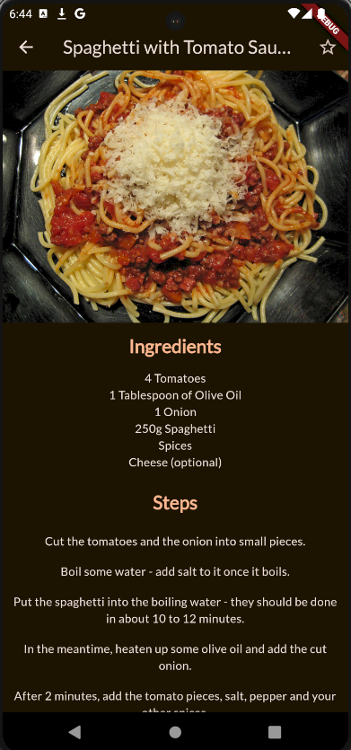
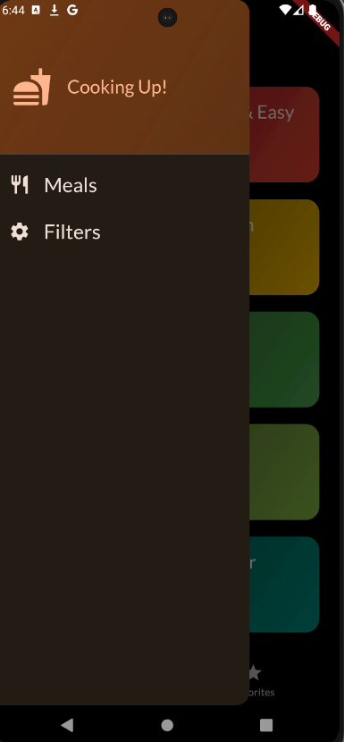

# Meals App (Flutter)
Meals App is an Android-based Meals Book application developed using Flutter. It organizes recipes by meal type and provides detailed cooking information including preparation time, difficulty level, cost, a comprehensive ingredients list, and step-by-step instructions. An intuitive side drawer allows users to seamlessly navigate between meal categories and filters, delivering a user-friendly experience.

## Features

- **Categorized Recipes:** Organizes meals by type (e.g., Breakfast, Lunch, Dinner) for easy browsing.
- **Detailed Cooking Information:** Each recipe displays preparation time, difficulty level, cost, ingredients, and step-by-step instructions.
- **Intuitive Navigation:** A side drawer facilitates effortless switching between meal categories and filter options.

## Screenshots

<p align="center">
  
  
  
</p>


## Getting Started

Follow these instructions to set up the project locally for development and testing.

### Prerequisites

- [Flutter](https://flutter.dev) installed on your machine.
- An IDE such as [Android Studio](https://developer.android.com/studio) or [Visual Studio Code](https://code.visualstudio.com/) configured for Flutter development.
- An Android device or emulator to run the app.

### Installation

1. **Clone the repository:**

   ```bash
   git clone https://github.com/Eshwar-M17/meals_app
   cd mealsapp
